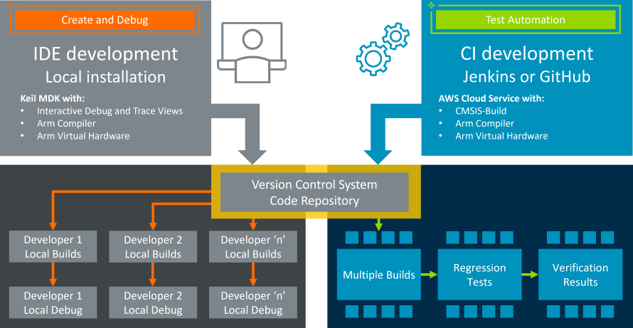

# Getting started with Arm Virtual Hardware

[**Arm Virtual Hardware**](https://www.arm.com/virtual-hardware) provides simulation models, software tooling, and infrastructure that can be integrated into CI/CD and MLOps development flows. The simulation models (called Arm Virtual Hardware Targets) are an implementation of a Cortex-M device sub-systems and are designed for complex software verification and testing. This allows simulation-based test automation of various software workloads, including unit tests, integration tests, and fault injection. Refer to the [Arm Virtual Hardware documentation](https://arm-software.github.io/VHT/main/overview/html/index.html) for more information.

This repository contains a simple getting started project that you can use as a template. 

## Repository structure

| Directory                     | Contents | Documentation |
|-------------------------------|----------|---------------|
| .github/workflow              | Workflow YML file that gets you started with GitHUb actions for CMSIS projects | 
| .jenkins                      | Two Jenkins examples (one using a VHT Python module, the other creating a Jenkins node from VHT AMI | [README.md](./.jenkins/README.md) |
| basic                         | The actual CMSIS example project | [README.md](./basic/README.md) |
| infrastructure/cloudformation | AWS Cloudformation template      | [README.md](./infrastructure/cloudformation/README.md) |

## Usage instructions

You can use this repository as a template for your own validation projects that use with Arm Virtual Hardware. Read the [documentation](https://arm-software.github.io/VHT/main/examples/html/GetStarted.html) to learn how to use it and understand which steps are required to make it work for you.

## Further reading

The links below provide access to additional developer resources:

| Resource           | Description                                                                                 |
|--------------------|---------------------------------------------------------------------------------------------|
| [Documentation](https://arm-software.github.io/VHT/main/overview/html/index.html) | Is a comprehensive documentation about Arm Virtual Hardware. |
| [Support Forum](https://community.arm.com/support-forums/f/arm-virtual-hardware-targets-forum) | Arm Virtual Hardware is supported via a forum. Your feedback will influence future roadmap. |
| [Product Roadmap](https://arm-software.github.io/VHT/main/overview/html/index.html#Roadmap) | Lists the features that we will deploy in the next 6 months. |
| [TFL Micro Speech](https://github.com/arm-software/VHT-TFLmicrospeech) | This example project shows the Arm VHT VSI interface with Audio input. |
| [Marketing Overview](https://www.arm.com/virtual-hardware) | Gives you a top-level marketing message. |
