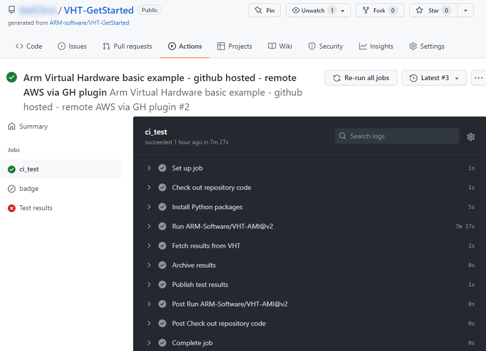

# Getting started with Arm Virtual Hardware Targets

Arm Virtual Hardware Targets (VHT) are precise simulation models of Cortex-M device sub-systems and are designed for complex software verification and testing. This allows simulation-based test automation of various software workloads, including unit tests, integration tests, and fault injection. Refer to the [Arm Virtual Hardware documentation](https://arm-software.github.io/VHT/main/overview/html/index.html) for more information.

This repository contains a simple getting started project that you can use as a template. 

## Repository structure

| Directory                     | Contents | Documentation |
|-------------------------------|----------|---------------|
| .github/workflow              | Workflow YML file that gets you started with GitHUb actions for CMSIS projects | 
| .jenkins                      | Two Jenkins examples (one using a VHT Python module, the other creating a Jenkins node from VHT AMI | [README.md](./.jenkins/README.md) |
| basic                         | The actual CMSIS example project | [README.md](./basic/README.md) |
| infrastructure/cloudformation | AWS Cloudformation template      | [README.md](./infrastructure/cloudformation/README.md) |

## Usage instructions

You can use this repository as a template for your own trials with Arm Virtual Hardware. These are the required steps:

- **Fork** the repository into your own GitHub account.
- Once forked, follow the [instructions](./infrastructure/cloudformation/README.md) to setup a stack in your AWS account to gain access to the required secrets.
- When done, go to the repository's **Settings** tab and select **Secrets - Actions**. Use the **New repository secret** button to generate these secrets:
  | Repository secret name    | CloudFormation/Stack/Key  |
  |---------------------------|---------------------------|
  | AWS_ACCESS_KEY_ID         | VHTAccessKeyId            |
  | AWS_ACCESS_KEY_SECRET     | VHTSecretAccessKey        |
  | AWS_EC2_SECURITY_GROUP_ID | VHTEC2SecurityGroupId     |
  | AWS_IAM_PROFILE           | VHTIAMProfile             |
  | AWS_S3_BUCKET_NAME        | VHTS3BucketName           |
  | AWS_DEFAULT_REGION        | Get from your AWS account (for example `us-east-1`) |
- You can now go to the repository's **Actions** tab, click on **Arm Virtual Hardware basic example** workflow and press **Run workflow**.
- Once the workflow has finished, you can observe the output by clicking on the workflow and then on the **ci_test** job:
  

## Further reading

The [Arm Virtual Hardware GitHub repository](https://github.com/arm-software/vht) provides access to the following developer resources:

| Resource           | Description                                                                                 |
|--------------------|---------------------------------------------------------------------------------------------|
| [Documentation](https://arm-software.github.io/VHT/main/overview/html/index.html) | Is a comprehensive documentation about Arm Virtual Hardware. |
| [Support Forum](https://community.arm.com/support-forums/f/arm-virtual-hardware-targets-forum) | Arm Virtual Hardware is supported via a forum. Your feedback will influence future roadmap. |
| [Product Roadmap](https://arm-software.github.io/VHT/main/overview/html/index.html#Roadmap) | Lists the features that we will deploy in the next 6 months. |
| [TFL Micro Speech](https://github.com/arm-software/VHT-TFLmicrospeech) | This example project shows the Arm VHT VSI interface with Audio input. |
| [Marketing Overview](https://www.arm.com/virtual-hardware) | Gives you a top-level marketing message. |