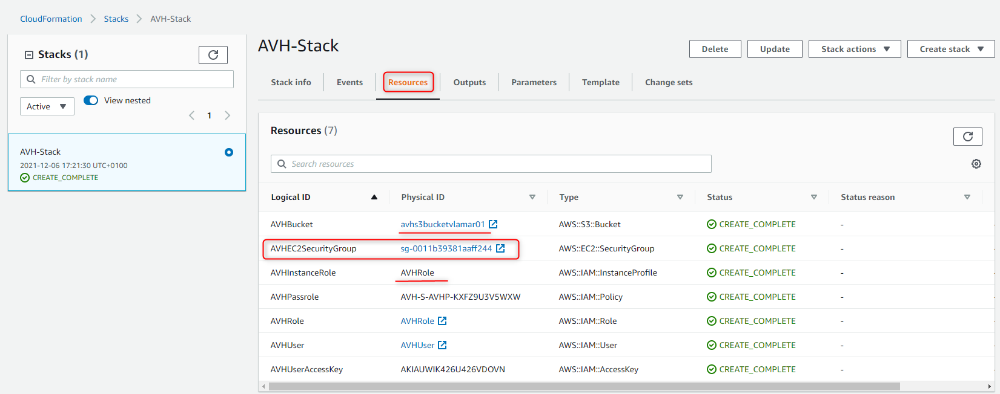

# AVH-AWS-Infra-CloudFormation
AVH CloudFormation for AVH AMI

This template creates the basic AWS infrastructure items required for using an Arm Virtual Hardware (AVH) Amazon Machine Image (AMI) with a [GitHub-hosted Runner](https://arm-software.github.io/VHT/main/infrastructure/html/run_ami_github.html#GitHub_hosted).

## Prerequisites
* AWS account
* Subscription to [AVH AMI](https://arm-software.github.io/VHT/main/infrastructure/html/index.html#Subscribe)

## What it creates
* One S3 Bucket (to store temporary files)
* One EC2 Security Group (to be associated with the EC2 instances)
* One IAM User and Access Keys (to limit access rights in the AWS)
* One IAM Role (to be associated with the EC2 Instances)

## CloudFormation inputs
* S3 Bucket Name
* VPC ID to be associated with the EC2 Security Group

## CloudFormation outputs
* Access Key ID
* Secret Access Key

The Access Key Id and corresponding Secret Access Key enable remote access for the AWS IAM User that gets created with this CloudFormation template.

## How to run it for the first time
1. Sign in with your AWS account on [aws.amazon.com](https://aws.amazon.com/) to land on `AWS Management Console` page.

2. Download [AVH-Cloudformation-Template.yaml](./AVH-Cloudformation-Template.yaml) file to your computer.

3. Type `Cloudformation` in the search and proceed to the corresponding AWS service page.

4. Click the `Create stack` button.

5. Select `Template is ready` option, and then `Upload a template file`.

6. With the `Choose file` button select the `AVH-Cloudformation-Template.yaml` file in your local computer.

7. Click `Next`.

8. Specify stack details as follows:
    - `Stack name`: use any name, for example AVH.
    - `S3BucketName`: shall have only small letters and numbers and be unique across AWS, as otherwise stack creation will fail later.
    - `Vpcid`: provide VPC ID for your target region. This can be found in `VPC` AWS service.

9. On `Configure stack options` page, keep default values and press `Next` button.

10. On `Review` page:
    - Acknowledge that a new AWS IAM User and AWS IAM AccessKey will be created.
    - Press `Create stack`.

11. The infrastructure described in the template file will be provisioned.

12. Wait until everything is completed. You can press `refresh` button to get the latest events.

13. Go to the created stack and in the _Resources_ tab, note the value for the following parameters, as they would are needed for access to the AVH AMI with this stack:
    - `AVHBucket`: lists the name of created S3 bucket. It is same as provided in step 8.
    - `AVHEC2SecurityGroup`: contains the name of created EC2 security group.
    - `AVHInstanceRole`: provides the name of created IAM Instance Profile.

14. Switch to the _Output_ tab of the stack. Note the values for the parameters: 
    - `AVHUserAccessKeyId`
    - `AVHUserSecretAccessKey`

This parameters enable access to the AWS resources created in the stack with the IAM user.

