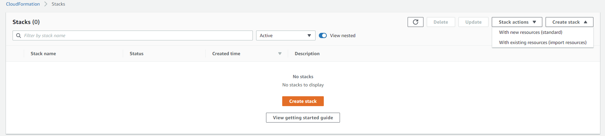
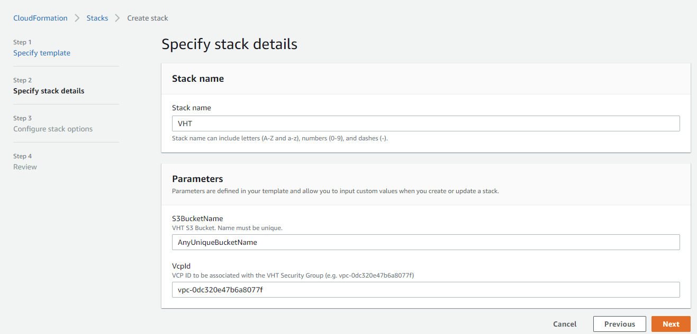
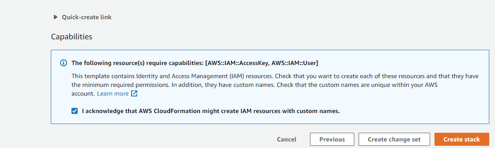
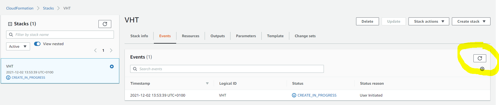
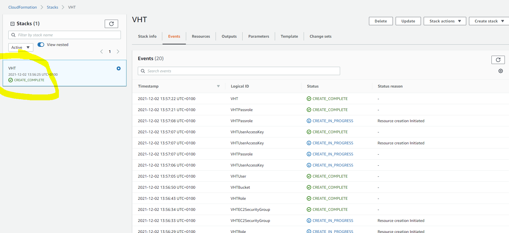
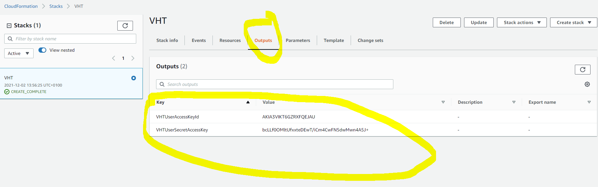

# VHT-AWS-Infra-CloudFormation
VHT Cloudformation Infrastructure as Code for AWS

This code aims to create the basic infrastructure to run [VHT-AMI GitHub Action](https://github.com/ARM-software/VHT-AMI) on a AWS account.

## What it creates
* An S3 Bucket (to store temporary files)
* An EC2 Security Group (to be associated with the EC2 instances)
* An IAM User and Access Keys (to limit access to the AWS Account)
* An IAM Role (to be associated with the EC2 Instances)

## Cloudformation inputs
* S3 Bucket Name (needs to be unique across AWS)
* VCP ID (to be associated with the EC2 Security Group)

## Cloudformation outputs:
* Access Key ID (needed for VHT-AMI GitHub Actions to have access to your account)
* Secret Access Key (needed for VHT-AMI GitHub Actions to have access to your account)

## How to Run for the first time
1. Go to your `AWS Management Console` (initial AWS page).
2. Search for `Cloudformation`.
3. Click in the `Create stack` button and `With new resources`.

4. Select `Template is ready`, then `Upload a template file` and click in the `Choose file` button.
5. Select the `VHT-Cloudformation-Template.yaml` file (in your local computer).
6. Click `Next` button.

7. The Cloudformation template requests as Parameters:
    1. Enter any Stack name you want it (e.g. VHT).
    2. The template requests the S3 Bucket Name (which needs to be unique across AWS, it will fail the execute later otherwise).
    3. The template requests the VCP ID (it can be found on `VPC` AWS service). It is expected the AWS account already has one.

8. On `Configure stack options` page, you can press `Next` button.
9. On `Review` page
    1. You need to acknowledge a new User and AccessKey will be created.
    2. Press `Create stack`.

10. The infrastructure describe in the code will be processed.
11. Wait until everything is completed (you can press `refresh` button to get the latest events).

12. Once it is completed, you are able to get:
    1. VHTUserAccessKeyId
    2. VHTUserSecretAccessKey

