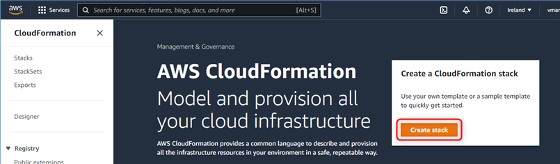
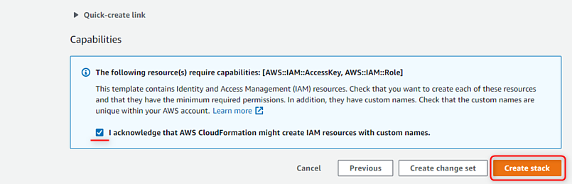

# AVH-AWS-Infra-CloudFormation
AVH CloudFormation for AVH AMI

This template creates the basic AWS infrastructure items required for using an Arm Virtual Hardware (AVH) Amazon Machine Image (AMI) with a [GitHub-hosted Runner] (https://arm-software.github.io/VHT/main/infrastructure/html/run_ami_github.html#GitHub_hosted).

## Prerequisites
* AWS Account
* Subscription to [AVH AMI](https://arm-software.github.io/VHT/main/infrastructure/html/index.html#AWS)

## What it creates
* An S3 Bucket (to store temporary files)
* An EC2 Security Group (to be associated with the EC2 instances)
* An IAM User and Access Keys (to limit access to the AWS Account)
* An IAM Role (to be associated with the EC2 Instances)

## Cloudformation inputs
* S3 Bucket Name
* VPC ID to be associated with the EC2 Security Group

## Cloudformation outputs
* Access Key ID: needed for VHT-AMI GitHub Actions to have access to your AWS account
* Secret Access Key: needed for VHT-AMI GitHub Actions to have access to your AWS account

## How to run it for the first time
1. Sign in with your AWS account on [aws.amazon.com](https://aws.amazon.com/) to land on `AWS Management Console` page.
2. Download [AVH-Cloudformation-Template.yaml](./AVH-Cloudformation-Template.yaml) file to your computer.
3. Type `Cloudformation` in the search and proceed to the corresponding AWS service page.
4. Click the `Create stack` button.

5. Select `Template is ready` option, and then `Upload a template file`.
6. With the `Choose file` button select the `AVH-Cloudformation-Template.yaml` file in your local computer.
7. Click `Next`.

8. Specify stack details as follows:
    - _Stack name_: use any name, for example AVH.
    - _S3BucketName_: shall have only small letters and numbers and be unique across AWS, as otherwise stack creation will fail later.
    - _Vpcid_: provide VPC ID for your target region. This can be found in `VPC` AWS service ().

9. On `Configure stack options` page, you can press `Next` button.
10. On `Review` page
    - You need to acknowledge that a new User and AccessKey will be created.
    - Press `Create stack`.

11. The infrastructure described in the template file will be created.
12. Wait until everything is completed. You can press `refresh` button to get the latest events.

13. Once it is completed, you can go to the created stack and in the _Output_ find:
    - AVHUserAccessKeyId
    - AVHUserSecretAccessKey

