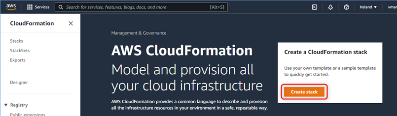
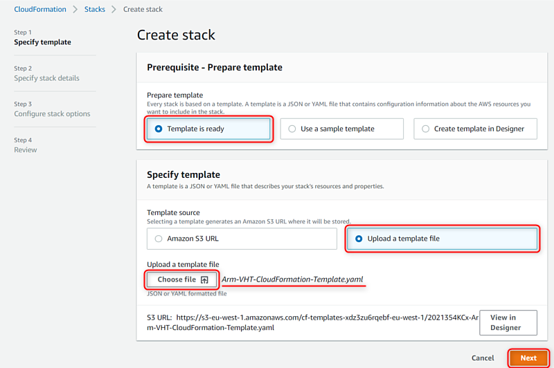
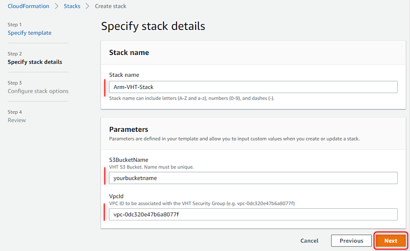
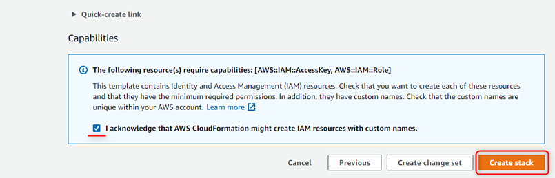
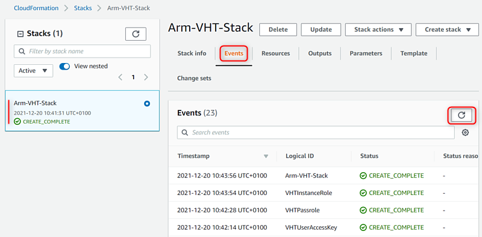
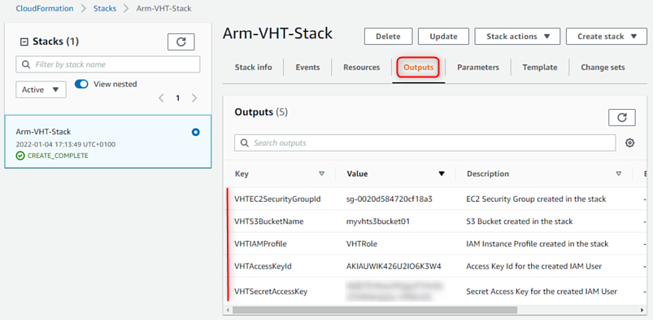

# Arm Virtual Hardware AWS-CloudFormation

The following section describes how to setup the AWS infrastructure for using the [Arm Virtual Hardware Amazon Machine Image (AMI)](https://arm-software.github.io/VHT/main/infrastructure/html/index.html#AWS).
Using a template file creates the setup that is for example required to run **Arm Virtual Hardware**  with a [**GitHub-hosted Runner**](https://arm-software.github.io/VHT/main/infrastructure/html/run_ami_github.html#GitHub_hosted).

## Prerequisites
* Use your [**AWS account**](https://aws.amazon.com/premiumsupport/knowledge-center/create-and-activate-aws-account/)
* Subscribe  [**Arm Virtual Hardware**](https://arm-software.github.io/VHT/main/infrastructure/html/index.html#Subscribe)

## What is Created
The `Arm-VHT-CloudFormation-Template.yaml` is a [AWS CloudFormation](https://docs.aws.amazon.com/cloudformation/index.html) template that creates the following AWS infrastructure items:
* One S3 Bucket (to store temporary files)
* One EC2 Security Group (to be associated with the EC2 instances)
* One IAM User and Access Keys (to limit access rights in the AWS)
* One IAM Role (to be associated with the EC2 Instances)

### Required User Input
* _S3BucketName_ that identifies the S3 Bucket.
* _VpcId_ to be associated with the EC2 Security Group.

### Provided Output
Resources to be used with Arm VHT AMI (see below in step 12).

## How to run it for the first time
1. Download the file [`Arm-VHT-CloudFormation-Template.yaml`](./Arm-VHT-CloudFormation-Template.yaml) to your computer.

2. Sign in with your AWS account on [aws.amazon.com](https://aws.amazon.com/) to open the AWS Management Console page.

3. Type `Cloudformation` in the search and proceed to the corresponding AWS service page.

4. Click the _Create stack_ button.

5. Select _Template is ready_ option, and then _Upload a template file_.

6. With the _Choose file_ button select the file `Arm-VHT-CloudFormation-Template.yaml` downloaded in step 1.

7. Click _Next_.

8. Specify stack details as follows:
    - _Stack name_: use any name, for example `Arm-VHT-Stack`.
    - _S3BucketName_: shall have only small letters and numbers and be unique across AWS, as otherwise stack creation will fail later.
    - _Vpcid_: provide VPC ID for your target region. This can be found in VPC AWS service.

9. On _Configure stack options_ page keep default values and press _Next_.

10. On _Review_ page:
    - Acknowledge that a new AWS IAM User and AWS IAM AccessKey will be created.
    - Press _Create stack_.

11. The infrastructure described in the template file will be provisioned. In _Events_ tab you can follow the creation process. Use _refresh_ button if the page does not get updated automatically. After a few minutes the stack creation should be successfully completed.

12. Go to the created stack and in the _Output_ tab, find the values for the parameters needed for using an Arm Virtual Hardware AMI:
    - `VHTEC2SecurityGroupId`: the name of created EC2 security group.
    - `VHTS3BucketName`: the name of created S3 bucket. It has the same value as provided in step 8.
    - `VHTIAMProfile`: the name of created IAM Instance Profile.
    - `VHTAccessKeyId`: the access key id for the IAM User created in the stack.
    - `VHTSecretAccessKey`: the secret access key value for the `VHTAccessKeyId`. See [access key pair](https://docs.aws.amazon.com/IAM/latest/UserGuide/id_credentials_access-keys.html) for details.

Note that when the cloud stack is not needed anymore CloudFormation service can be also used to easily delete the stack including all the provisioned resources. In this case it need to be ensured that the EC2 instance associated with the created EC2 Security Group is terminated before stack delete is started.
